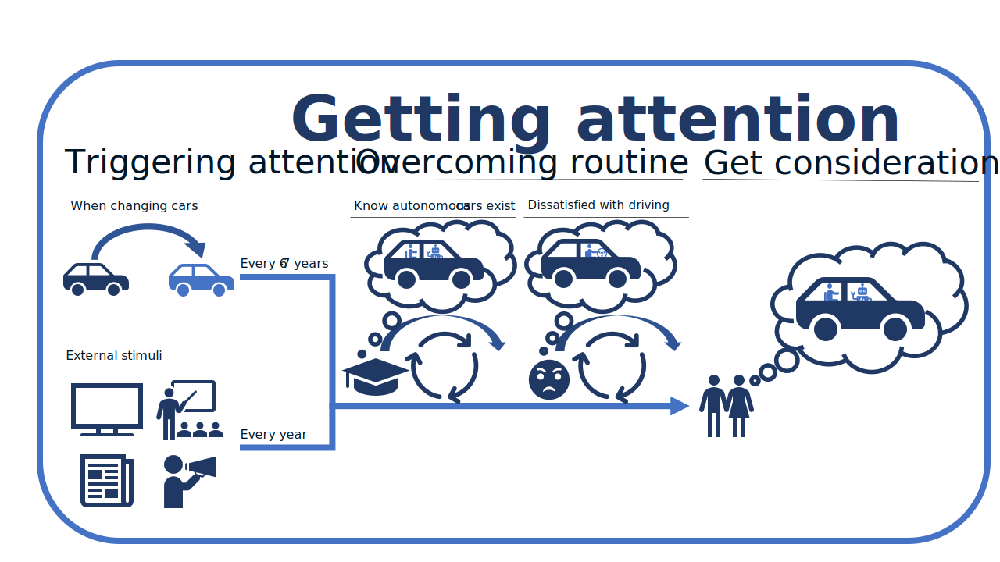
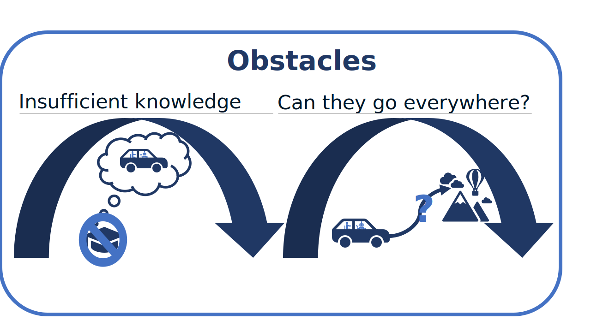
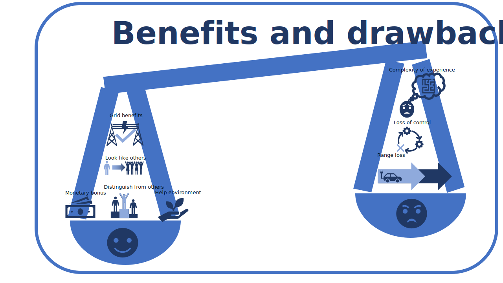

# **pLAtYpus**

This repository contains the pLAtYpus 
model.

## Authors and contact
Carlos Montalvo (carlos.montalvo@tno.nl)
Omar Usmani (Omar.Usmani@TNO.nl)


## Installation and use
### Installation
Install the model via Pypi:
```
pip install pLAtYpus_TNO
```
(or copy the files in the src/pLAtYpus_TNO/ folder)
You will also need a configuration file that can be found in the root folder
of the [Github repository](https://https://github.com/TNO/pLAtYpus)
### Use

## Model explanation
### Phases
#### Attention
</td>

#### Enable
</td>

#### Attention
</td>

## Sources 
### Map data
The map boundaries are taken from eurostat/EuroGeoGraphics
https://gisco-services.ec.europa.eu/distribution/v2/nuts/nuts-2021-files.html
© EuroGeographics for the administrative boundaries
You can download them there and put the into the input/map_data/ folder
For running the whole model, you also need survey data
in the input/survey_data/ folder
Note that the survey data is not yet publically available.
Contact the authors for more information.
As such, you cannot run all the functions of the model.
You can however use the ones in GRETA_tool,
or you can use the following code to make the outputs (this code is
in the make_all_outputs.py source file)
```

from ETS_CookBook import ETS_CookBook as cook

try:
    from pLAtYpus_TNO import solver
except ModuleNotFoundError:
    import solver

try:
    from pLAtYpus_TNO import maps
except ModuleNotFoundError:
    import maps


def make_all_outputs(parameters):
    solver.get_all_evolutions_and_plots(parameters)
    maps.make_long_term_average_tables(parameters)
    maps.make_area_maps(parameters)
   

if __name__ == '__main__':
    parameters_file_name = 'pLAtYpus.toml'
    parameters = cook.parameters_from_TOML(parameters_file_name)
    make_all_outputs(parameters)
```

You can however run the tool part with the provided pLAtYpus.sqlite3
(and its version containing only survey data, used for resets) 
that is in the output/  folder in the
[Github repository](https://https://github.com/TNO/pLAtYpus)

## Licence

pLAtYpus is released under the Apache 2.0 licence.
All accompanying documentation and manual are released under the 
Creative Commons BY-SA 4.0 license.

## Libraries/dependencies
For the used libraries, see requirements.txt
To create the right running environement, do the following:
1) Create virtual environment: python -m venv your_environment_name
2) your_environment_name/Scripts/activate.bat
3) virtualenv --clear /your_environment_name
4) Select interpreter (in help if using VS Codes) and choose the
    one in your_environment_name
5) Kill terminal
5) Start new terminal 
6) Install the requirements: pip install -r requirements.txt   

## **Context, goals, and future developments**

### **Driver**
The primary driver for the publication and development of pLAtYpus in this
repository is the participation in the [GRETA](https://projectgreta.eu/) 
project (funded from 
the European Union’s 
HORIZON 2020 Research and Innovation programme 
under grant agreement N°101022317.).

### **Goal**
The main goal of providing this repository is transparency regarding the 
assumptions and computations of the pLAtYpus model.

### **Uses outside GRETA**

#### **Prior to GRETA**
##### Change and Innovation
1. [Explaining and predicting the impact of regulation on innovation: towards a dynamic model, Carlos Montalvo, International Journal of Public Policy, Vol 2, pp 5-31](https://www.inderscienceonline.com/doi/abs/10.1504/IJPP.2007.012274)
2. [Carlos Montalvo,
What triggers change and innovation?,
Technovation,
Volume 26, Issue 3,
2006,
Pages 312-323,
ISSN 0166-4972,](https://www.sciencedirect.com/science/article/pii/S0166497204001531)
3. [Environmental Policy and Technological Innovation
Why Do Firms Adopt or Reject New Technologies? (New Horizons in the Economics of Innovation Series), Carlos Montalvo, An edition of Environmental Policy and Technological Innovation (2002)](https://openlibrary.org/books/OL12563883M/Environmental_Policy_and_Technological_Innovation)

##### CODEC
1. [Geerte L. Paradies, Omar A. Usmani, Sam Lamboo, Ruud W. van den Brink,
Falling short in 2030: Simulating battery-electric vehicle adoption behaviour in the Netherlands,
Energy Research & Social Science,
Volume 97,
2023,
102968,
ISSN 2214-6296](https://www.sciencedirect.com/science/article/pii/S2214629623000282)
2. [Modelling consumer decisions towards 
sustainable energy technology, S. Brunsting, R. Matton, C. Tigchelaar, l. Dreijerink, G.L. Paradies, J. Jamssen, O. Usmani, TNO, Decmeber 2018](https://publications.tno.nl/publication/34627599/zZ5Fcw/TNO-2018-P11304.pdf)
3. [Marc Londo, Robin Matton, Omar Usmani, Marieke van Klaveren, Casper Tigchelaar, Suzanne Brunsting,
Alternatives for current net metering policy for solar PV in the Netherlands: A comparison of impacts on business case and purchasing behaviour of private homeowners, and on governmental costs,
Renewable Energy,
Volume 147, Part 1,
2020,
Pages 903-915,
ISSN 0960-1481](https://www.sciencedirect.com/science/article/pii/S0960148119313928)


#### **After/during GRETA**

1. [Montalvo, C., Schlindwein, L., Ruggieri, B., Kantel, A. (2021).
Framework for research on energy citizenship emergence structure
and dynamics. D1.1 of the Horizon 2020 project GRETA, EC grant
agreement no 101022317, The Hague, The Netherlands](https://projectgreta.eu/wp-content/uploads/2022/01/GRETA_D1_1_Energy-citizenship-emergence-framework_v1_0.pdf)
2. [López, A.; Hermoso, N.; Sánchez, B.; Usmani, O.; Montalvo, C.;
Abel, D.; Lieth, J.; Jünger, S.; Kuronen, T.; Lensu, L. (2023). 
Definition of the modelling framework. D4.2 of the Horizon 2020 
project GRETA, EC grant agreement nº 101022317, Bilbao, Spain.](https://projectgreta.eu/wp-content/uploads/2023/06/GRETA_D4.2_Modelling-framework.pdf)


#### **Future**
pLAtYpus will be used in other projects that will be listed here, if deemed
relevant and apprpriate within the context of these projects.


## Acknowledgments
&nbsp;
<hr>
<center>
<table width=500px frame="none">
<tr>
</td>
<td valign="middle" width=100px>
</td>
<td valign="middle">The pLAtYpus model orginally has been developped within
[GRETA](https://projectgreta.eu/), which has received funding 
from the European Union’s 
HORIZON 2020 Research and Innovation programme 
under grant agreement N°101022317.</td>
<tr>
</table>
</center>


